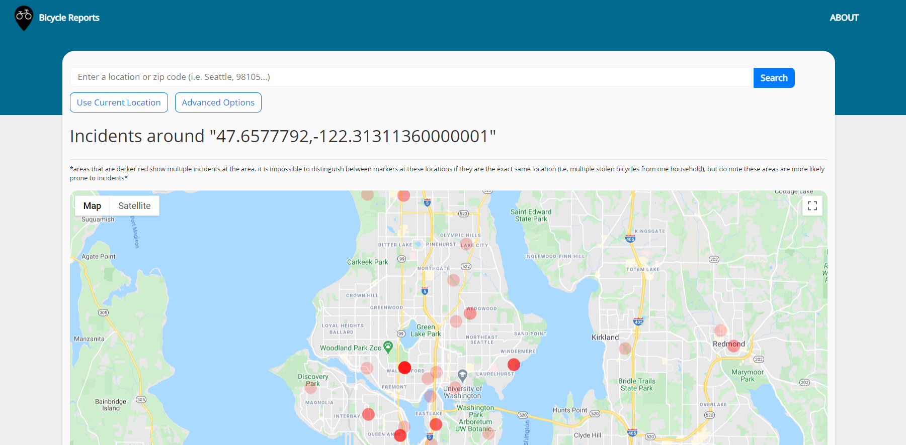

[Online](https://bicycle-reports.wn.r.appspot.com/)

[DemoVideo](https://www.youtube.com/watch?v=q80NuuSIvxE)

Bicycle Reports is a web app created with the goal of helping bike riders navigate their
local areas. By showing incidents around a searched location, users may use their best
judgment in deciding if an area is deemed safe or not. Similarly, other users may find
more information about stolen bikes and assist in the search for the rightful owners.
Bicycle Reports is a simple tool that hopes to serve as a hub for all bicycle incidents
using a map as a visual aid and cards for further details.

## Getting Started
Please obtain a Google Maps API key using the instructions here:
https://developers.google.com/maps/documentation/embed/get-api-key

After duplicating this project,
Replace "YOUR_API_KEY" in mapsKey.py with your obtained API key.

Then, you may run main.py and open localhost:8080 for personal use.